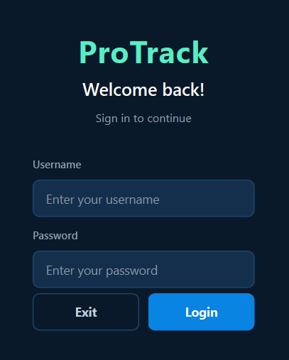
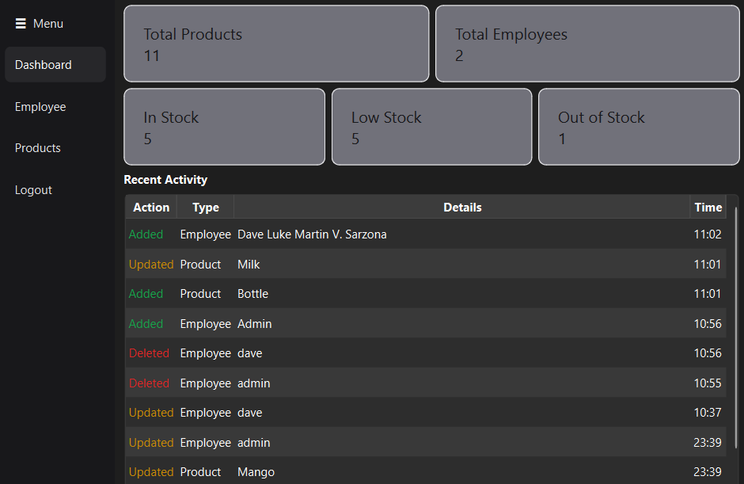
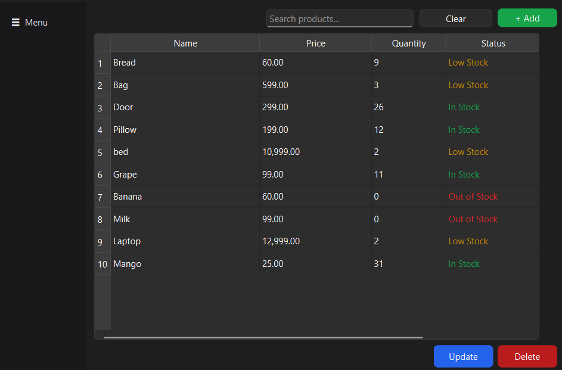
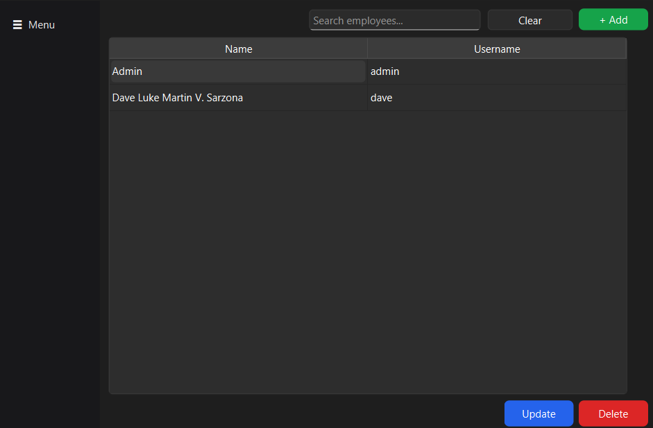

<h1 align="center">ProTrack</h1>

## About

ProTrack lets you sign in, manage your product stock, manage the employees who can access the system, and keep an eye on everything through a live dashboard with a recent-activity feed.

Each part of the app (products, employees) lives in its own feature folder and is split into model, repository, service, and view layers. The UI never talks to the database directly, which keeps the code easy to read, test, and extend.

A default admin account is created automatically on first run, so you can log in right away.

 

  
  

 

## Features

- **Secure login** – employees sign in with a username and password. Passwords are never stored in plain text.
- **Product management** – add, update, delete, and search products (name, price, quantity).
- **Automatic stock status** – each product's status is computed from its quantity.
- **Employee management** – add, update, delete, and search employees. Usernames are unique, and leaving the password blank when editing keeps the current one.
- **Dashboard** – quick overview for products and employees, a breakdown of In Stock / Low Stock / Out of Stock items, and the 10 most recent actions.
- **Activity log** – every add, update, and delete is recorded with a timestamp and shown on the dashboard.
- **Input validation** – negative prices/quantities, empty fields, and duplicate usernames are rejected with clear messages.
- **Default admin account** – created automatically on first run so you can log in right away.

  
  &nbsp;&nbsp;
  

